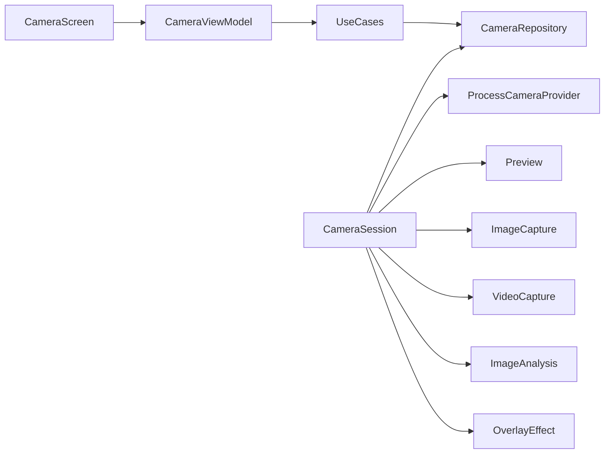

# CameraX

A Play Store camera app in Kotlin, built with [Jetpack CameraX](https://developer.android.com/media/camera/camerax) 1.6. It is a working reference other apps can copy: photo, video, OEM extensions, live filters, and ML Kit face overlay, with a Compose UI.

[](https://play.google.com/store/apps/details?id=com.arindam.camerax)

[](https://opensource.org/licenses/Apache-2.0)
[](LICENSE)

- [Project page](https://arindamxd.github.io/projects/camerax)
- [Privacy policy](https://arindamxd.github.io/projects/camerax/privacy-policy)
- [Author](https://arindamxd.github.io/)

## What this project is

The **app** is named CameraX. It is built with the Jetpack **CameraX library** (lifecycle-aware, Camera2 under the hood, API 21+). This repo is the app, not the library — you can install it, tap through it, and copy patterns from it.

| In the app | What it demonstrates |
| --- | --- |
| **Photo** | Still capture with flash, timer, grid, pinch zoom, tap-to-focus |
| **Video** | Record with audio, pause / resume, mute, elapsed timer, `.mp4` in gallery |
| **Effects** | OEM HDR / Night / Portrait / Beauty (when the device supports them), color filters, face boxes |

Unsupported OEM chips stay hidden. If a device cannot bind preview + photo + video + analysis together, the camera falls back (drop analysis, drop video, stills only) instead of crashing.

## Try it

1. Grant **camera** and **microphone**.
2. Swipe **Photo / Video / Effects** at the bottom.
3. Photo shutter is a white disc; video is red and becomes a stop square while recording.
4. In Effects, pick a filter, an extension chip, or face detection.
5. Open the thumbnail to browse, share, or delete photos and videos.

## Architecture

Single `:app` module, package-level Clean Architecture:

```
ui  →  domain  ←  data
```



| Layer | Package | Role |
| --- | --- | --- |
| Presentation | `ui/` | Compose chrome, `CameraViewModel` (UI state, countdown, mode) |
| Domain | `domain/` | Models, `CameraRepository`, use cases (`CapturePhoto`, `StartRecording`, `BindCamera`, …) |
| Data | `data/camera/` | `CameraSession` — CameraX implementation of `CameraRepository` |
| Composition root | `di/AppContainer` | Manual DI; UI never constructs `CameraSession` |

`CameraFragment` is only a Compose host. Preview is wrapped as `PreviewViewHost` (`CameraHost`) so domain code does not import `PreviewView`.

### Where to look

```
app/src/main/java/com/arindam/camerax/
  domain/model/          CameraMode, FlashMode, RecordingEvent, …
  domain/repository/     CameraRepository, MediaRepository
  domain/usecase/        CapturePhoto, StartRecording, BindCamera, …
  data/camera/           CameraSession, ColorFilterProcessor, Overlay + CameraX mappers
  data/media/            FileMediaRepository (latest jpg/heic/dng/mp4)
  data/local/            SharedPreferences
  di/                    AppContainer
  ui/home/camera/        CameraScreen, CameraChrome, CameraViewModel
  ui/home/gallery/       Photo + video pager
```

## CameraX API map

| Control | API |
| --- | --- |
| Viewfinder | `Preview` + `PreviewView` |
| Photo | `ImageCapture` |
| Video, pause, mute | `VideoCapture` + `Recorder` + `Recording` |
| Flash / torch | `ImageCapture.flashMode` + `CameraControl.enableTorch` |
| Pinch zoom and 0.5 / 1x / 2x chips | `CameraControl.setZoomRatio` / `ZoomState` |
| Tap to focus | `FocusMeteringAction` |
| HDR / Night / Portrait / Beauty | `ExtensionsManager` (`ExtensionMode`) |
| Live color filters | `CameraEffect` + `SurfaceProcessor` on preview and video; same matrix on still JPEGs |
| Face boxes on preview **and** video | `ImageAnalysis` + `MlKitAnalyzer` + `OverlayEffect` (`PREVIEW \| VIDEO_CAPTURE`) |

Face boxes are drawn with `OverlayEffect`, not a Compose canvas, so they are burned into recordings.

Copy-paste path for another app: start at [`CameraRepository`](app/src/main/java/com/arindam/camerax/domain/repository/CameraRepository.kt) and [`CameraSession`](app/src/main/java/com/arindam/camerax/data/camera/CameraSession.kt).

## Stack

- Kotlin 2.2, Jetpack Compose, CameraX **1.6.1**
- minSdk **23**, target/compileSdk **37**
- Navigation, ViewModel, Coil, ML Kit face detection
- Optional Firebase Analytics / Crashlytics when `app/google-services.json` is present

## Build

```sh
./gradlew assembleDebug
```

Open the project in Android Studio and run the `app` configuration on a device or emulator with a camera. Microphone is optional hardware (`android.hardware.microphone` is not required).

## Test

```sh
./gradlew test                  # JVM (Robolectric)
./gradlew connectedAndroidTest  # device / emulator via ADB
```

In Android Studio: **Run → Edit Configurations → Add** → `Android JUnit` (Robolectric) or `Android Instrumented Tests`, module `app`, class `com.arindam.camerax.MainInstrumentedTest`.

## Stretch (not in this app yet)

ConcurrentCamera (front + back), full photo editor.

## Contributing

Pull requests are welcome. Follow [CONTRIBUTING.md](CONTRIBUTING.md) and target the `development` branch.

### Find this project useful?

Star the repo if it helped you ship a camera feature.

### Contact

- [Author](https://arindamxd.github.io/)
- [Twitter](https://twitter.com/arindamxd)
- [LinkedIn](https://in.linkedin.com/in/arindamxd)
- [GitHub](https://github.com/arindamxd)

## License

Copyright 2019-2026 Arindam Karmakar

Licensed under the Apache License, Version 2.0. See [LICENSE](LICENSE).

Portions of the original camera sample are from the
[Android Open Source Project](https://github.com/android/camera-samples).
