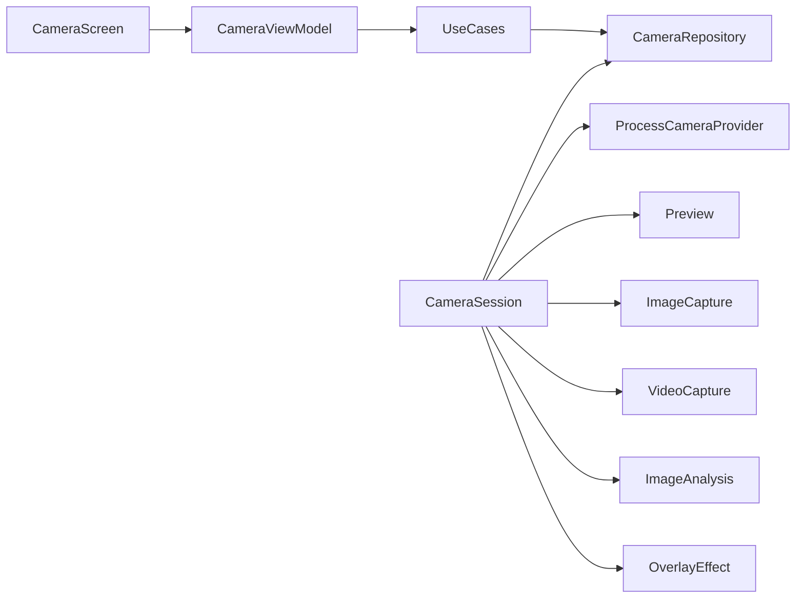

# CameraX

A Play Store camera app in Kotlin, built with [Jetpack CameraX](https://developer.android.com/media/camera/camerax) 1.6. It is a working reference other apps can copy: photo, video, OEM extensions, live ColorMatrix effects (`ImageAnalysis`), and Dual preview, with a Compose UI.

[](https://play.google.com/store/apps/details?id=com.arindam.camerax)

[](https://opensource.org/licenses/Apache-2.0)
[](LICENSE)

- [Project page](https://arindamxd.github.io/projects/camerax)
- [Privacy policy](https://arindamxd.github.io/projects/camerax/privacy-policy)
- [Author](https://arindamxd.github.io/)

## What this project is

The **app** is named CameraX. It is built with the Jetpack **CameraX library** (lifecycle-aware, Camera2 under the hood, API 21+). This repo is the app, not the library — you can install it, tap through it, and copy patterns from it.

| In the app | What it demonstrates |
| --- | --- |
| **Photo** | Still capture with flash, timer, grid, pinch zoom, tap-to-focus |
| **Video** | Record with audio, pause / resume, mute, 60 fps when listed, `.mp4` in gallery |
| **Slo-mo** | High-speed `Preview` + `VideoCapture` when the device lists SDR high-speed qualities |
| **Effects** | Live ColorMatrix effects on `ImageAnalysis` (None, Grayscale, Invert, Sepia, Cool, Warm, Vivid) |
| **Pano** | Horizontal sweep stitch |
| **Dual** | Concurrent front + back preview (`availableConcurrentCameraInfos`) |

Unsupported OEM chips stay hidden. If a device cannot bind preview + photo + video together, the camera falls back (drop video, stills only) instead of crashing. Dual falls back to concurrent preview-only if stills cannot bind.

## Try it

1. Grant **camera** and **microphone**.
2. Swipe **Photo / Video / Slo-mo / Effects / Pano / Dual** at the bottom (Slo-mo and Dual hide when unsupported). Quick controls on the live feed change with the selected mode; the gear opens full Settings.
3. Photo shutter is a white disc; video is red and becomes a stop square while recording.
4. In **Effects**, pick None / Grayscale / Invert / Sepia / Cool / Warm / Vivid. The live feed is the processed `ImageAnalysis` frame; switching chips does not rebind.
5. Open the thumbnail to browse, share, or delete photos and videos.

## Architecture

Single `:app` module, package-level Clean Architecture:

```
ui  →  domain  ←  data
```



| Layer | Package | Role |
| --- | --- | --- |
| Presentation | `ui/` | Compose chrome, `CameraViewModel` (UI state, countdown, mode) |
| Domain | `domain/` | Models, `CameraRepository`, use cases (`CapturePhoto`, `StartRecording`, `BindCamera`, …) |
| Data | `data/camera/` | `CameraSession` — CameraX implementation of `CameraRepository` |
| Data | `data/media/` | `FileMediaRepository` — disk + MediaStore on `Dispatchers.IO` |
| Composition root | `di/AppContainer` | Manual DI + `AppDispatchers`; UI never constructs `CameraSession` |

`CameraFragment` is only a Compose host. Preview is wrapped as `PreviewViewHost` (`CameraHost`) so domain code does not import `PreviewView`.

### Where to look

```
app/src/main/java/com/arindam/camerax/
  domain/model/          CameraMode, CameraModeCatalog, bind config
  domain/repository/     CameraRepository, MediaRepository
  domain/usecase/        CapturePhoto, StartRecording, BindCamera, …
  data/camera/           CameraSession, ColorEffectAnalyzer, mappers
  data/media/            FileMediaRepository, MediaStorePublisher
  di/                    AppContainer (composition root)
  ui/home/camera/        CameraScreen, CameraChrome, CameraViewModel
  ui/home/gallery/       Photo + video pager
  ui/settings/           SettingsCatalog + SettingsScreen
```

## CameraX API map

| Control | API |
| --- | --- |
| Viewfinder | `Preview` + `PreviewView` |
| Photo | `ImageCapture` |
| Video, pause, mute | `VideoCapture` + `Recorder` + `Recording` |
| Flash / torch | `ImageCapture.flashMode` + `CameraControl.enableTorch` |
| Pinch zoom and 0.5 / 1x / 2x chips | `CameraControl.setZoomRatio` / `ZoomState` |
| Tap to focus | `FocusMeteringAction` |
| HDR / Night / Portrait / Beauty | `ExtensionsManager` (`ExtensionMode`) |
| Live color-matrix effects | `ImageAnalysis` + `ColorMatrix` / `ColorMatrixColorFilter` (`ColorEffectAnalyzer`) |
| Dual preview | `ProcessCameraProvider.bindToLifecycle(List)` + concurrent camera infos |
| 60 fps video | `SessionConfig` + `GroupableFeature.FPS_60` after `isSessionConfigSupported` |

Copy-paste path for another app: start at [`CameraRepository`](app/src/main/java/com/arindam/camerax/domain/repository/CameraRepository.kt) and [`CameraSession`](app/src/main/java/com/arindam/camerax/data/camera/CameraSession.kt).

## Stack

- Kotlin **2.4**, Jetpack Compose, CameraX **1.6.1**
- minSdk **23**, target/compileSdk **37**
- Navigation, ViewModel, Coil
- Optional Firebase Analytics / Crashlytics when `app/google-services.json` is present
- Release: R8 + resource shrinking, native debug symbols (`SYMBOL_TABLE`) for Play Console

## Build

```sh
./gradlew assembleDebug
./gradlew bundleRelease    # Play Store App Bundle (needs signing in local.properties)
```

Signing for `bundleRelease` is read from `local.properties` (`storeFile`, `storePassword`, `keyAlias`, `keyPassword`). Release signing applies to the `release` build type only. Do not commit the keystore.

Open the project in Android Studio and run the `app` configuration on a device or emulator with a camera. Microphone is optional hardware (`android.hardware.microphone` is not required).

## Test

```sh
./gradlew testDebugUnitTest     # JVM (Robolectric + fakes)
./gradlew lintDebug             # Android lint (CI runs this)
./gradlew connectedDebugAndroidTest  # device / emulator via ADB
```

In Android Studio: **Run → Edit Configurations → Add** → `Android JUnit` (Robolectric) or `Android Instrumented Tests`, module `app`, class `com.arindam.camerax.MainInstrumentedTest`.

## Play Store release

See **[RELEASE.md](RELEASE.md)** for the full checklist (version bump, signing, artifacts, upload).

Quick paths:

| Artifact | Command / path |
| --- | --- |
| AAB | `./gradlew bundleRelease` → `app/build/outputs/bundle/release/` |
| R8 mapping | `app/build/outputs/mapping/release/mapping.txt` |
| Native symbols | `./gradlew printNativeDebugSymbols` |

## Threading

Repositories run disk and MediaStore work on `Dispatchers.IO`. ViewModels use `withContext` for metadata, review, and gallery probes. Debug builds enable StrictMode (log-only) to catch main-thread disk access. See [AGENTS.md](AGENTS.md).

## Stretch (not in this app yet)

Full photo editor; catalog-style green-screen (selfie segmentation over the back camera); Scan / ML Kit analysis. Dual is concurrent preview, not that overlay.

## Contributing

Pull requests are welcome. Follow [CONTRIBUTING.md](CONTRIBUTING.md) and target the `development` branch.

### Find this project useful?

Star the repo if it helped you ship a camera feature.

### Contact

- [Author](https://arindamxd.github.io/)
- [Twitter](https://twitter.com/arindamxd)
- [LinkedIn](https://in.linkedin.com/in/arindamxd)
- [GitHub](https://github.com/arindamxd)

## License

Copyright 2019-2026 Arindam Karmakar

Licensed under the Apache License, Version 2.0. See [LICENSE](LICENSE).

Portions of the original camera sample are from the
[Android Open Source Project](https://github.com/android/camera-samples).
